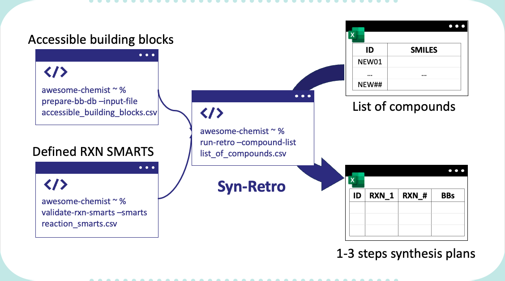

[](https://github.com/Synple-Chem/syn-retro-public/actions/workflows/python-app.yml)
[](https://www.rdkit.org/)
[](https://opensource.org/licenses/MIT)

# Rule-Based Retrosynthesis python package
Syn-retro project decomposes compounds with the defined reaction SMARTS and given set of accessible building blocks. The package is developed in python and can be used as a python package or a command line tool.



The rule-based retrosynthesis is processed in following steps:
1. Match all possible the templates with the target compound
2. Fragment the compound with the matched templates
3. Search the fragments in the database
4. Repeat 1-3 until all fragments are found

Steps 1-2 are wrapped as `fragement_compound` function in `syn_retro` package. The function takes a compound and a retrosynthesis reaction smarts as inputs and returns a list of fragments. Then, `search_fragment` function processes step 3. The function has two modes, exact inchi key search mode and similarity search mode. By default, it uses exact inchi key search mode. The similarity search mode is used when the exact inchi key search mode fails to find the fragment.

These two functions are wrapped in `retrosynthesis` function in `syn_retro` package. The function takes a compound and a retrosynthesis reaction smarts as inputs and returns a list of fragments and the corresponding id from the database. The function repeats the process until all fragments are found. The users can specify the number of iterations. The default number of iterations is 3. In Synple Chem, we have demonstrated that three step reactions can cover more than 10^12 of chemical space.

For the bulk retrosynthesis process, the users can use `retrosynthesis_bulk` function in `syn_retro` package. The function takes a list of compounds and a retrosynthesis reaction smarts as inputs and returns a list of fragments and the corresponding id from the database. The function repeats the process until all fragments are found. The users can specify the number of iterations. The default number of iterations is 3. This function uses multiprocessing to speed up the process.

## Pre-requisites of building block database and reaction assets
To enable the retrosynthesis model, the users needs to provide the list of building blocks in `.csv` file with a colmn with building block id (named as `id`, integer) and building block smiles (named as `smiles`, and preferrably a parent mol, such as [ChEMBL parent mol](https://github.com/chembl/ChEMBL_Structure_Pipeline)). With the following command, a temporal sqlite database will be generated with the provided building blocks.

By default, a table called `building_blocks` will be generated with the following columns: `id`, `smiles`, `cano_smiles`, `inchi_key`, `parent_smiles`, `parent_inchi_key`.

```
prepare_bb_db --csv-path "PATH_TO_CSV_FILE" --db-path "PATH_TO_DB_FILE" --reagent-class-assets "assets/sub_smarts.yaml"
```
The users can also provide the substrate smarts in yaml file. The yaml file should be in the following format:
```
reagent_name_1: smarts_1
reagent_name_2: smarts_2
...
```
When substrate smarts are provided, then it makes tables for each substrates. In this case, for bb searching, the search space is restrict to the substrates, thus, a faster search.


## Setup
Setup python package:

    make

If make doesn't work, manually set upt the environment:

	conda env create -f ./environment.yaml -p ./env
	./env/bin/python -m pip install -e .

Then, activate the environment:

    conda activate ./env
